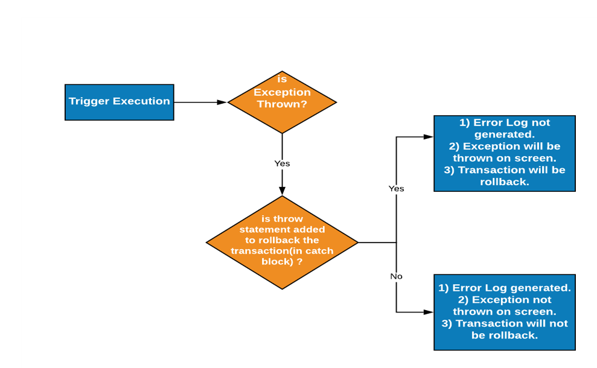
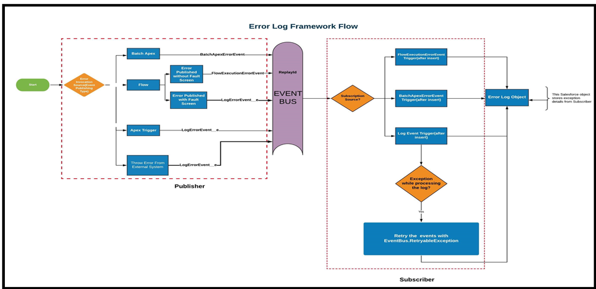
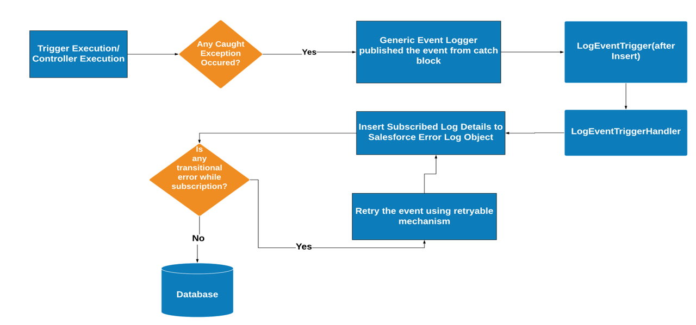
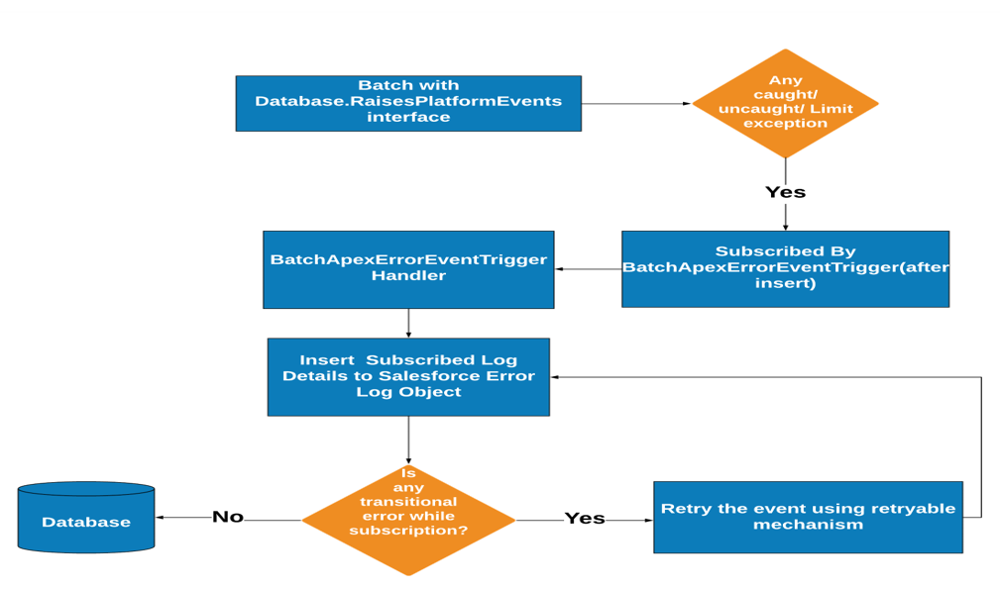
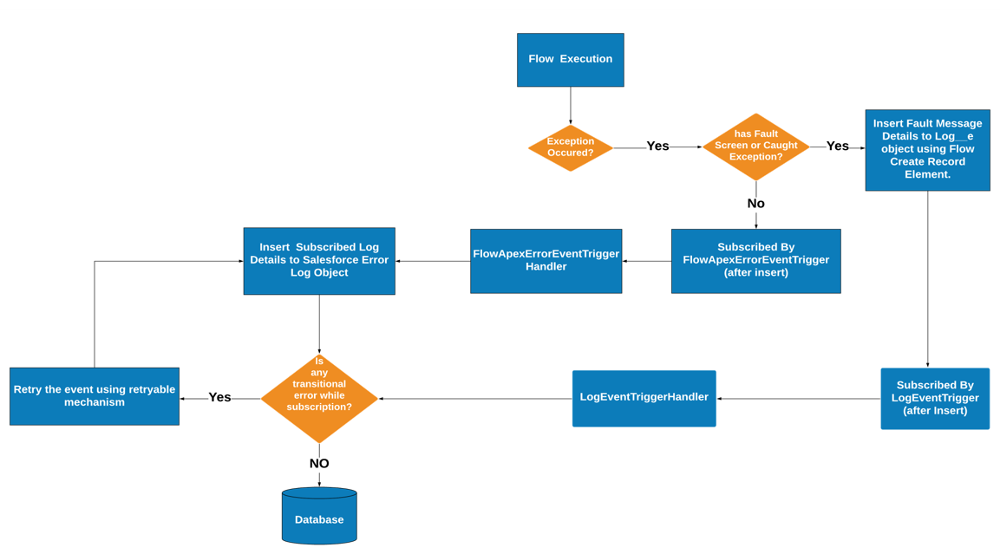

# ErrorLogger With Platform Event Framework

An Error Logging Framework by leveraging Platform Event.

## Problem-
- In trigger context, if we are performing rollback using throw statement from catch block, we won't be able to store the error logs in salesforce, since all the DML will be rolled back.
- Database.rollback does not work for trigger context sobject.
- It was impossible to see from the “Apex Job Log” if batch jobs are successful or not, since all caught exceptions are reported as “success”.
- An additional DML operation is needed in the same transaction.

## Benefit of Framework -

- This framework gives us a generic architecture to log errors published from Apex, Batch Apex, Flow.
- Since a platform event trigger runs in a separate transaction from the one that fired it, governor limits are reset, and the event trigger gets its own set of limits.
- By setting the publish behaviour of a platform event to "Publish Immediately", event message will get published regardless of whether the synchronous trigger transaction succeeds.

### Apex Error Framework Using PE

### Batch Apex Framework Using PE

### Flow Error Framework Using PE

### Platform Events used in this framework - 
-  BatchApexErrorEvent  (Standard)

    To fire a platform event, a batch Apex class declaration must implement the Database.RaisesPlatformEvents interface. Otherwise BatchApexErrorEvent will not be fired on getting an exception. This event can capture LIMIT exception as well . Published Internally by Salesforce when batch exception occurred.

- FlowExecutionErrorEvent (Standard)

    Notifies subscribers of errors related to screen flow executions. Messages for this platform event aren’t published for autolaunched flows or processes. This object is available in API version 47.0 and later. . This event can capture LIMIT exception as well. Published Internally by Salesforce when flow exception occurred.

- **Log** Custom Platform Event

    Notify subscribers of any caught error. Need to publish this custom event explicitly using Event.publish

Q. **Is There Any Event Delivery Limitation?**

    Non-CometD clients, including Apex triggers, processes, and flows, don’t count against the event delivery limit. The number of event messages that an Apex trigger, process, or flow can process depends on how long the processing takes for each subscriber. The longer the processing time, the longer it takes for the subscriber to reach the tip of the event stream.

Q. **Can this framework be extended?**

    Absolutely. With built-in Custom Metadata configuration support, custom error handling logic can be developed by implementing simple interface without changing the default error logging implementation.
